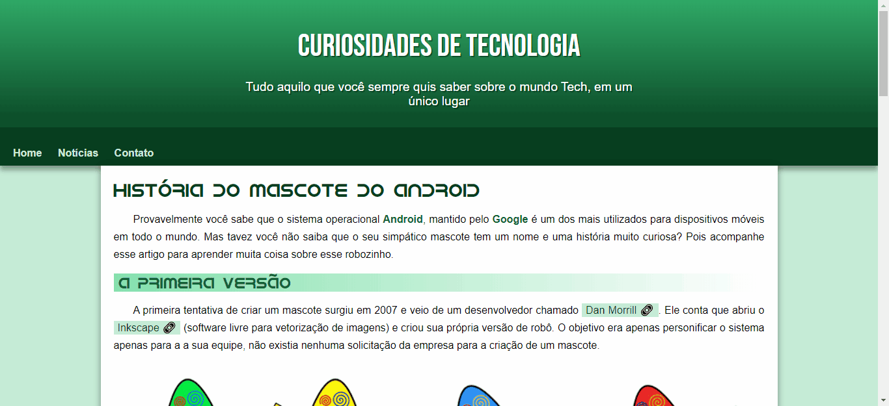

# Projeto Android

Acesse o projeto <a href="https://jonathanrianelli.github.io/projeto-android/">aqui</a>

## Descrição

Projeto criado no curso do Gustavo Guanabara (<a href="https://www.youtube.com/c/CursoemV%C3%ADdeo">Curso em Vídeo</a>)

## Tecnologias Usadas
- ✔️ HTML
- ✔️ CSS

## Layout 
### Desktop:

